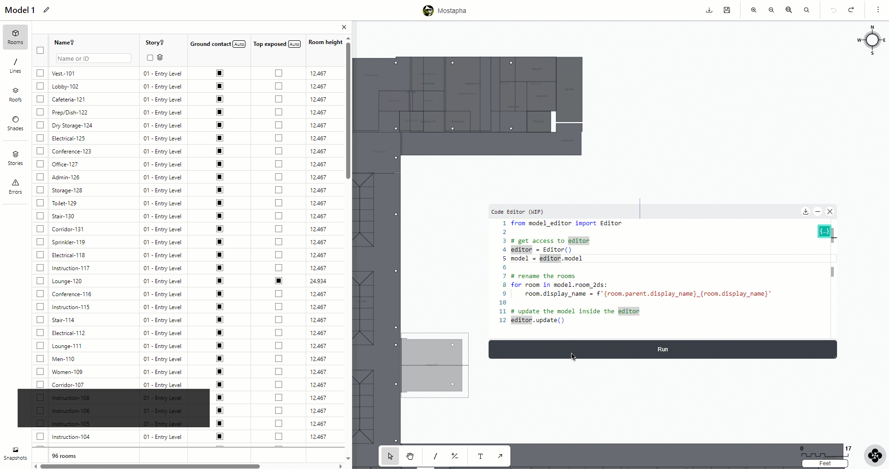

# Your First Python Script

## The anatomy of a Python script

In most typical scenarios your code is structured into 3 sections:

1. The first section of the code loads either the full model or the selected objects in the model into the editor.
2. The second section is where you write your logic. You can write a code to count the number of rooms, change the room names, or anything else that you need.
3. Finally, and in most cases, you want to update the existing model in the Model Editor based on the changes made in the second section.

Lucky for you, the Python script editor includes a special `model_editor` module. This module includes a special class named`Editor`. This class provides all the functionalities that you need for the first and last step so you can focus on writing your custom logic.

Here is a sample code that includes all the 3 sections.

```python
from model_editor import Editor

# get access to editor contents
editor = Editor()

# add your logic here
for room in editor.model.room_2ds:
    room.display_name = f'{room.parent.display_name}_{room.display_name}'
    
# update the model inside the editor
editor.update()
```


For more information about the Editor class, see the Editor API documentation [here](editor-class-api-documentation.md).


## Your first script

For your first script, let's use this feature request from Heath as an example. She is looking for an option to add the level name in front of the rooms. We have heard several versions of this request over the years, and it is a great use case of using a Python script.

<figure><figcaption><p><a href="https://discourse.pollination.cloud/t/pollination-model-editor-is-almost-ready/3871/5?u=mostapha">https://discourse.pollination.cloud/t/pollination-model-editor-is-almost-ready/3871/5</a></p></figcaption></figure>


You should already know the answer if you read the previous section! #spoiler


### Access the model

The first step is to import the Editor class from the model\_editor module.

```python
from model_editor import Editor
```

The `Editor` object provides several functionalities but the most common use case is to access the model from the editor. We first need to create an instance of the `Editor` class, and then access the model. This model is a Dragonfly model. [You can find the documentation for the Dragonfly model object here](https://www.ladybug.tools/dragonfly-core/docs/dragonfly.model.html#dragonfly.model.Model).

```python
editor = Editor()
model = editor.model
```

### Rename the rooms

Now that we have access to the model we can iterate through the room\_2ds and rename them one by one. We access the name of the story/level by using the `parent` property of the `room_2d` object. You can see the documentation for a Dragonfly `Room2D` [here](https://www.ladybug.tools/dragonfly-core/docs/dragonfly.room2d.html#module-dragonfly.room2d).

```python
for room in model.room_2ds:
    room.display_name = f'{room.parent.display_name}_{room.display_name}'
```


In some cases, you might also have room\_3ds in your model but we ignore that for this example to keep it simple!


### Update the model

If you run the code as is, you will see that nothing happens to the model inside the Model Editor. This is because you need to explicitly tell the Model Editor to replace the existing model with the new model from the Python editor. Just add this line at the end of your code and you should see the change happening to the model.

```python
editor.update()
```

Try to run the code and you should see the room display names being updated. :magic\_wand:

<figure><figcaption><p>Running the code from inside the Model Editor</p></figcaption></figure>

Here is what the full code looks like.

```python
from model_editor import Editor

# get access to editor
editor = Editor()
model = editor.model

# rename the rooms
for room in model.room_2ds:
    room.display_name = f'{room.parent.display_name}_{room.display_name}'
    
# update the model inside the editor
editor.update()
```

### Debugging your code

The Python script editor is currently very limited and doesn't provide many functionalities for debugging the code. The error messages should be printed out to the logger but our suggestion for now is to test your code in a standard Python editor on a Dragonfly model before using it in the Model Editor.

<figure><figcaption><p>You can select show logger from the user settings menu</p></figcaption></figure>

The good news is that you can always use Ctrl + Z to undo the change if you don't like the outcome of running your script.
