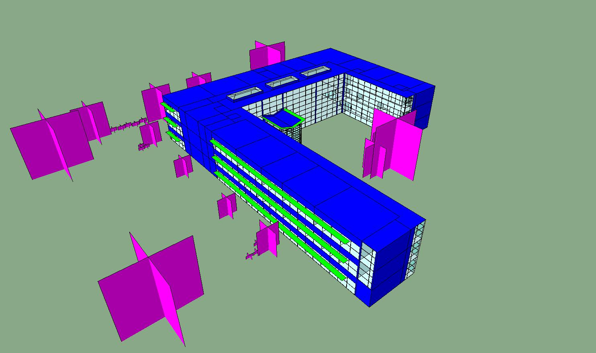

# Typical Editing Process Breakdown

The process for editing models can vary on a model-by-model basis. This section tries to list the typical process for cleaning a model using the Model Editor.

## Fix visible misalignments and gaps

First, you need to fix the visible misalignments in the model where the room walls/edges are not aligned. You can also remove the small holes from the model and fill the gaps between the rooms. The most frequently used commands for this step are:

* .svg>) [Auto Align](commands/me_auto_align.md)
* .svg>) [Align \[to Line\]](commands/me_align.md)
* .svg>) [Remove Holes](commands/me_remove_holes.md)
* .svg>) [Pull to Room](commands/me_pull_to_room.md)
* .svg>) [Remove Short Segments](commands/me_remove_short_segments.md)
* .svg>) [Join Coplanar Faces](commands/me_join_coplanar_faces.md)

## Fill holes with rooms, and merge smaller rooms

The next step is to place the missing rooms and merge the small rooms like small ducts, risers, and shafts with adjacent rooms. The most frequently used commands for this step are:

* .svg>) [Fill Holes \[with Rooms\]](commands/me_fill_holes.md)
* .svg>) [Merge Small Rooms](commands/me_merge_small_rooms.md)

## Fix small misalignments and gaps

After finding and fixing all the visible issues, it is time to inspect the model for invisible issues that you might have missed. The Model Editor provides a collection of commands and utilities to help with this process:

* [Find Adjacency Gaps](commands/me_find_adjacency_gaps.md)
* Highlight Non-orthogonal Walls (Alt + O)
* .svg>) [Solve Adjacency](commands/me_solve_adjacency.md)
* Highlight External Walls (Alt + E)

When you find any of these issues, you can use the commands from the first step to fix the alignment and gaps. In some cases, with a small overlap between the rooms, you may find the [Subtract Rooms](commands/me_subtract_rooms.md) command helpful and easier than using the alignment commands. You might also use the [Fill Holes](commands/me_fill_holes.md) command to fill the small holes between the rooms.

## Ensure model validation

One last step before exporting the model is to ensure the model is valid by using the [Validate Model](commands/me_validate_model.md) command. If you have followed steps 1-3, you should have resolved most of the validation errors related to the floor plans already. The most common validation issues that you might see at this point are related to the overlapping windows and doors. Use the [Repair Windows](commands/me_repair_windows.md) command to fix those validation issues.

## Edit slanted and extended roofs

In some models, with slanted roofs or extended roofs, you may also need to [edit the roofs or convert the roof extensions to shade objects](workflows/editing-roofs.md). The most frequently used commands for this step are:

* [Create Boundary](commands/me_create_boundary.md)
* .svg>)[Split \[Roofs\]](commands/me_split.md)
* .svg>) [Roofs to Shade](commands/me_roof_to_shade.md)
* .svg>) [Find Roof Intersection](commands/me_find_roof_intersection.md)
* .svg>) [Subtract Roofs](commands/me_subtract_roofs.md)
* .svg>) [Align \[Roofs to Lines\]](commands/me_align.md)
*  [Preview Roofs](commands/me_preview_roofs.md)

## Export the model

Once the editing is complete, you have the flexibility to export the model to any of the [supported file formats](supported-file-formats/export.md).

<figure><figcaption></figcaption></figure> <figure><figcaption></figcaption></figure>

<figure><figcaption></figcaption></figure> <figure><figcaption></figcaption></figure>

The next section includes a collection of the most common Model Editor workflows.
