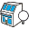
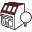

# Navigating Pollination Plugin Tab

Once Revit opens, you can find a tab for Pollination in the ribbon. The Pollination tab has 3 sections:

* Plugin
* Resources
* Model

<figure><figcaption>
Pollination Tab
</figcaption></figure>

Below is the list of different sections and buttons:

## Plugin

### License Manager

Use the License Manager button to return your existing license or retrieve a new license. [See here for more information](managing-pollination-revit-license.md).

### Discourse

Use the Discourse to open the Pollination Discourse website. The link takes you directly to the Revit category.

### User Manual

Use the User Manual button to access the Pollination Revit user manual (this page).

### About

Use the About button to see the information about the libraries installed in the Revit plugin.

<figure><figcaption></figcaption></figure>

###  Enable/Disable Pollination

Use this button to enable or disable the Pollination plugin. Note that disabling the plugin erases any information related to Pollination from this model. You will **NOT** be able to access this information by enabling the plugin.

###  Update Checker

This button will notify you when a newer version of the Pollination Revit plugin is available. You can click on the button to go to the download page and download the latest version of the plugin.

### Reload Setting

This button reloads all the levels, phases, and links from Revit. This data is used by Pollination when creating an energy model.

## Resources

###  Material Manager

Select to access the available materials for energy simulation. You can also use this menu to create new materials or edit existing ones.

###  Construction Manager

Select to access the available constructions for energy simulation. You can also use this menu to create new constructions or edit existing ones.

###  ConstructionSet Manager

Select to access the available construction sets for energy simulation. You can also use this menu to create new construction sets or edit existing ones.

###  Schedule Manager

Select to access the available schedules for energy simulation. You can also use this menu to create new schedules or edit existing ones.

###  Program Type Manager

Select to access the available program types for energy simulation. You can also use this menu to create new program types or edit existing ones.

## Model

###  Show Bounding

Use this button to highlight the room-bounding elements in the view.

###  Hide Bounding

Use this button to turn off the highlighted room-bounding elements in the view.

###  Un-Group All

Use this button to ungroup all the grouped items in Revit.

###  Manage Room Properties

Use this button to manage the properties for the selected rooms. The room properties manager allows for changing the construction set, program types, and HVAC, among other room properties.

***

###  Select Doors & Windows

Use the Select Windows/Doors menu to select the Revit families that should be translated to windows, skylights, or doors when exporting the rooms.

###  Select Roofs

Use the Select Roofs menu to select the Revit roof families that should be included in the Pollination model.

###  Export Rooms

Use Create Rooms to create Pollination rooms from Revit rooms, spaces, or areas. This menu also allows you to assign room properties and export them to a Pollination snapshot.

###  Export Shades

Use the Create Shades menu to select the objects in the Revit model that should be translated to shades. You can export the shades snapshot directly or include it as part of the rooms snapshot.

###  Export Model

Use this button to edit the snapshots and export them to any of the [supported file formats](../../model-editor/supported-file-formats/export.md).
