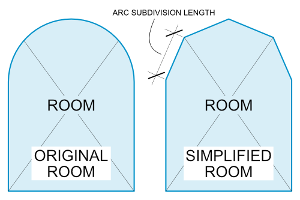
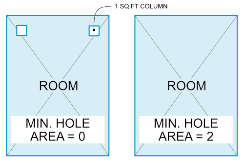

# Export Settings

Pollination provides several settings to control the export process. For this tutorial and most other cases, you don't need to change any of the default values, nevertheless, it is useful to understand every setting.

<figure><figcaption></figcaption></figure>

## Export Settings

### Boundary Location

This setting determines the location of room boundaries. The default option is "At Wall Center", suitable for most energy modeling tools, except IDA ICE. For IDA ICE, select "At Wall Finish", which creates a gap between rooms.

<figure><figcaption>
At Wall Center vs At Wall Finish
</figcaption></figure>

### Room Parsing Timeout (s)

Set the maximum time Revit plugin should spend trying to parse a single room before it ignores the room. Setting this value is useful for larger models with complex curtain walls to ensure a single room doesn't block the parsing process of other rooms.

### Tolerance (ft)

The model tolerance. The default value is 0.0033 ft, which is around 1 mm. You rarely need to change this value.

### Bounding Box Offset (ft)

This setting defines the offset value for the room bounding box when locating doors and windows for each room. The default is 1 ft, suitable for most buildings. Adjust this value only for buildings with very thick walls and windows near the exterior, far from the room boundary.

### Arc Subdivision Length (ft)

This value sets the subdivision length for dividing arc edges of the rooms. Setting this value to a smaller value will generate a shape that is closer to the original geometry, but generates many surfaces. The default value is set to 2 ft, which should work fine for most cases.

<figure><figcaption></figcaption></figure>

### Min. Hole Area (document area units)

This setting is used to set an option to ignore 'room holes' with an area smaller than the specified value. This option is particularly useful when trying to ignore columns that are typically 'room bounding' elements and often participate in room geometry creation, resulting in holes being added to rooms. The default value for this option is set to '0', which will process all such columns.

<figure><figcaption>
Minimum hole area
</figcaption></figure>

### Phase

Select the appropriate project phase from the dropdown. Typically, rooms are assigned to the "New Construction" phase, representing the latest changes. In renovation projects that involve new construction, rooms may span multiple phases. In such cases, select all relevant phases.

### Display Name

Set the room naming format to customize room names. By default, room names feature the room number and name separated by a dash, such as: 101 - Living Room


More advanced techniques are available in the Model Editor for naming rooms using various room properties, including user data. Check out [this topic on Discourse](https://discourse.pollination.solutions/t/ability-to-denote-general-room-space-types-or-have-manage-room-properties-pick-up-the-room-space-tag-info/2890/24) for an example.


### User Data

By default, the Pollination plugin only exports the geometry information and doesn't include any of the other Revit parameters. In some advanced workflows, you might want to use the Revit properties to later modify the model in the Model Editor, Grasshopper, or the Pollination Rhino plugin. For those cases, you can select the user data that you would like to be exported as part of the room.

<figure><figcaption>
User Data Menu
</figcaption></figure>

Once you review the settings, click on the right arrow to go to the next step.

## Frequently Asked Questions

### Can we use the outer or inner sides of the walls as room boundaries instead of the center of the wall?

Revit doesn't support having two different boundary locations for interior versus exterior walls. That means you have to select the center of the wall for both exterior and interior walls. To address this limitation, we have developed a workflow to offset the exterior walls inwards or outwards in the Model Editor. See [this section](../../../model-editor/workflows/adjusting-floor-plans-for-exterior-wall-thickness.md) for more information.

### Can I export other room/space/area properties from the Revit model?

Yes. You can export any of the Revit parameters as user data. [See above](export-settings.md#user-data).
