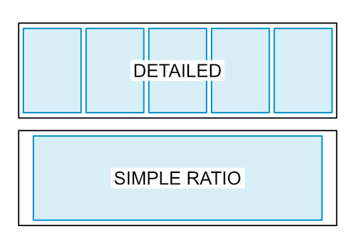

# For Those Who Want to Know More

## Understanding the 3 Preview Options

Pollination provides 3 different preview options.

<figure><figcaption>
3D Preview Options
</figcaption></figure>

Starting from right to left:

1. Reload Preview: This button creates a preview of the selected rooms based on their latest properties.
2. Update Properties & Reload Preview: This button updates the room Pollination properties, such as "Height" and "Is Top Exposed," before generating the preview. This option is slightly slower than the first option, and should only be used when you have made a change in any Pollination properties.
3. Reparse Geometry & Reload Preview: This button re-parses the selected rooms from Revit before generating the preview. This option could be much slower than the other two options, and should only be used when there has been a change in the Revit model (such as editing the room boundary, or windows/doors selection) or there is a need to re-parse the room because of changes in Pollination properties. For example, when the room height is changed and you need to re-parse the room to project the windows based on the new height.

## Excluding Windows, Doors, and Roofs from the Export

In some cases, mostly when dealing with larger models, you may want to exclude the windows, doors, and roofs from the initial parsing when trying to understand the quality of the model and the necessary steps. For such cases, use the options on steps 3 and 4 to exclude windows, doors, and roofs from the parsing and visualization steps.

<figure><figcaption>
Exclude Options
</figcaption></figure>


These options are also helpful for debugging the model and understanding which part of the model might be adding the complexity. In particular, we have just recently started to support non-planar roofs, and we expect to find some problematic models in the first couple of months. This option will allow you to continue exporting the model even though it may not include the non-planar roof.


## Understanding the Levels Table

This section provides a basic explanation of every column in the Levels Table.

<figure><figcaption>
Levels Table
</figcaption></figure>

### Name

This column includes the level names in Revit. The level names in Revit are always unique in each model.

### Elevation

A numerical value that indicates the elevation of the level. This value is useful to sort the levels and calculate the extrusion height.

### Geometry Source

Pollination can use Revit Rooms, Area, or Spaces as the source of creating Pollination rooms. You need to select the correct source based on your model. In the Revit sample model, we will be using Rooms since the model includes several rooms.

<figure><figcaption></figcaption></figure>

### Geometry Calculation

Pollination supports two different methods for geometry calculation: Extruded Floors and Full Volume. Unless the model includes tilted walls, choose the `Extruded Floors` method for Geometry Calculation.

### Window Calculation

Pollination supports two different methods for calculating the windows. The `Detailed` method creates a separate piece of glass for each window or curtain wall panel, while the `Simple Ratio` creates a single window per wall based on the sum of the area of all the windows in the wall.

<figure><figcaption></figcaption></figure>

The best practice is to use the `Detailed` method to ensure the window geometry is exported correctly. You can always use the [Simplify Windows](../../../model-editor/commands/me_simplify_windows.md) command in the Model Editor to simplify the windows, if necessary.

### Rooms/Spaces/Areas

These columns show the number of rooms, spaces, or areas that have been placed on each level. Not every level in a Revit model is used to place rooms, spaces, or areas. You can hide all those levels by selecting the `Hide Levels without Rooms/Spaces/Areas`.

<figure><figcaption></figcaption></figure>

### Computational Height

Computation height is the distance above the room level where the room perimeter is calculated. Unless you're using the `Full Volume` for Geometry Calculation, you won't need to change this value. [You can read more about Room Computational Height in this post](https://www.engipedia.com/revit-room-computation-height-what-is-it-good-for/).

### Extrusion Height

A numerical value in document units that sets the extrusion height for all the Pollination rooms that are created based on the rooms, spaces, or areas on the level.


If left empty, Pollination tries to _guess_ the room height based on the Revit geometry, which is unlikely to be what you would want in an energy model.



This value is only used in the Extruded Floors mode and will be ignored when Full Geometry is used.


