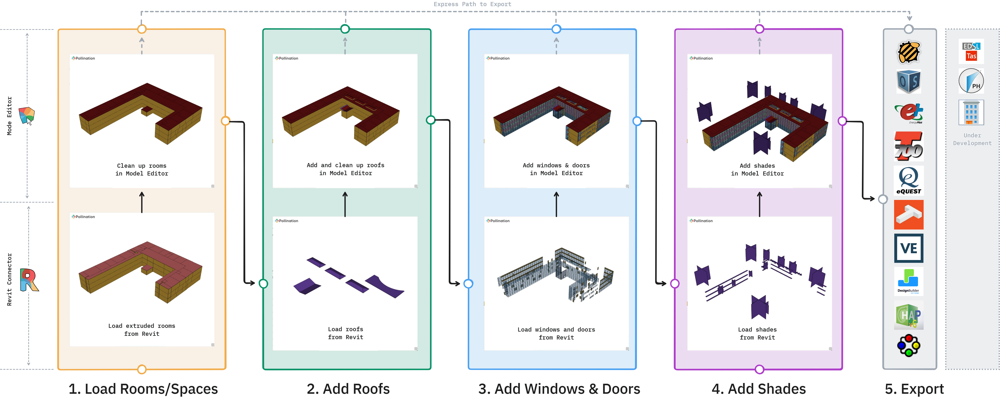

# Export your First Model

Preparing a Revit model for energy simulation can be a complex task. We designed this plugin to help you navigate that process one step at a time, breaking down the technical hurdles into manageable milestones. This hands on tutorial walks you through the process of exporting a simulation-ready model from your Revit model. If you are looking for a shorter demo, [see the demo page](../pollination-revit-plugin-demos.md).

## Revit plugin components

The Pollination Revit Plugin consists of three main component. It starts with the **Pollination Tab** in Revit, which communicates through the **Revit Connector** to the **Model Editor**.

<figure><figcaption></figcaption></figure>

## Understanding the typical export process

Image below shows the typical workflow of exporting a model from Revit.

<figure><figcaption></figcaption></figure>

Once you open the Pollination Revit plugin by clicking on the **Export Model** button, you will follow these steps to build our model:

### Step 1: Load Rooms/Spaces

<figure><figcaption></figcaption></figure>

In the first step we will load Revit rooms, spaces, or areas into the Model Editor. This step includes reviewing the rooms in the Model Editor and fixing any visible or hidden issues in the model with the help of Model Editor commands. At the end of this step we will have a valid model that consists of all the extruded Pollination rooms.

### Step 2: Add Roofs

<figure><figcaption></figcaption></figure>

In the second step, we will load the roofs from Revit and add them to the Model Editor. You only want to export roofs if they are slanted roofs or have a different height than the default floor extrusion height. In most models, you will need to perform some clean up on the roofs in the Model Editor to ensure they align with the room boundaries and remove any unwanted holes or overlaps.

### Step 3: Add Windows & Doors

<figure><figcaption></figcaption></figure>

In the third step, we will load the openings from Revit and add them to the model inside the Model Editor. We will see how to customize the frame thickness and the type of the curtain panel before adding them to your model. At the end of this step we will have a full valid model with the sloped roofs and all the windows and doors.

### Step 4: Add Shades

<figure><figcaption></figcaption></figure>

In the fourth step, we will load any the necessary Revit elements as shading objects.

### Step 5: Export Model

<figure><figcaption></figcaption></figure>

Finally, we will head to the Export panel to send your model to your simulation engine of choice. Pollination supports a growing list of software, and we are continually working on adding new ones. If you don't see your energy modeling software of choice here, feel free to reach out to us to discuss possibilities.
