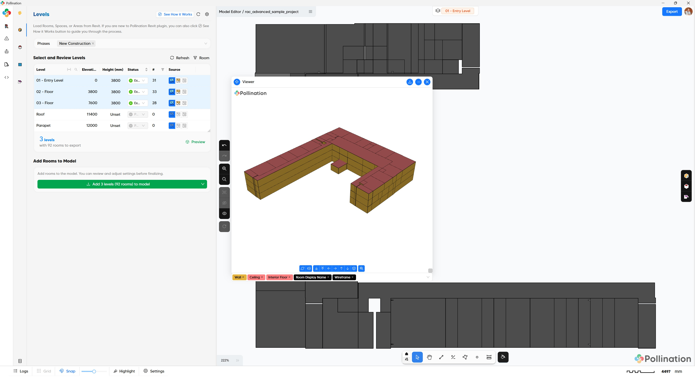
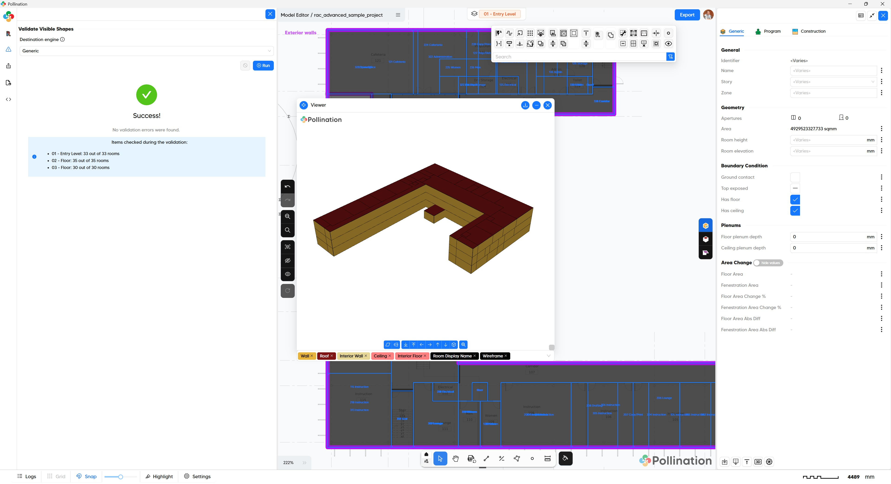

# Step 1: Load Revit Rooms/Spaces

<figure><figcaption></figcaption></figure>

In the first step we will load Revit rooms, spaces, or areas into the Model Editor. This step includes reviewing the rooms in the Model Editor and fixing any visible or hidden issues in the model with the help of Model Editor commands. At the end of this step we will have a valid model that consists of all the extruded Pollination rooms.

## Typical workflow

Follow these steps to prepare your room geometry for export:

1. **Review and Select Sources per Level**: Choose Rooms, Spaces, or Areas for each level. Note: Pollination defaults to the category with the highest count.
2. **Review & Add Missing Rooms**: Right-click a level and select Review to open the Revit plan view. Add any missing rooms, spaces or areas directly in Revit.
3. **Sync Changes**: After editing in Revit, right-click the level and select Refresh Data.
4. **Set to Export**: Change the Export Status column to "Export" for all levels you wish to include.
5. **3D Preview**: Click Preview to inspect the geometry. If needed, adjust Arc Subdivision or Min Hole Area in the settings.
6. **Finalize**: Click Add to Model to begin the geometry cleaning process.

### Pro Tips

1. You can batch-edit multiple levels at once by holding `Ctrl` while selecting levels.
2. You can use the **How it works** button to get a quick interactive tour of the steps in the UI.

## Pollination models

<figure><figcaption>
Extruded rooms from Revit at the start of the Step 1
</figcaption></figure>



<figure><figcaption>
Cleaned up extruded rooms as the end of the step 1
</figcaption></figure>



## Video Tutorials

Watch these videos for a step-by-step guide:






