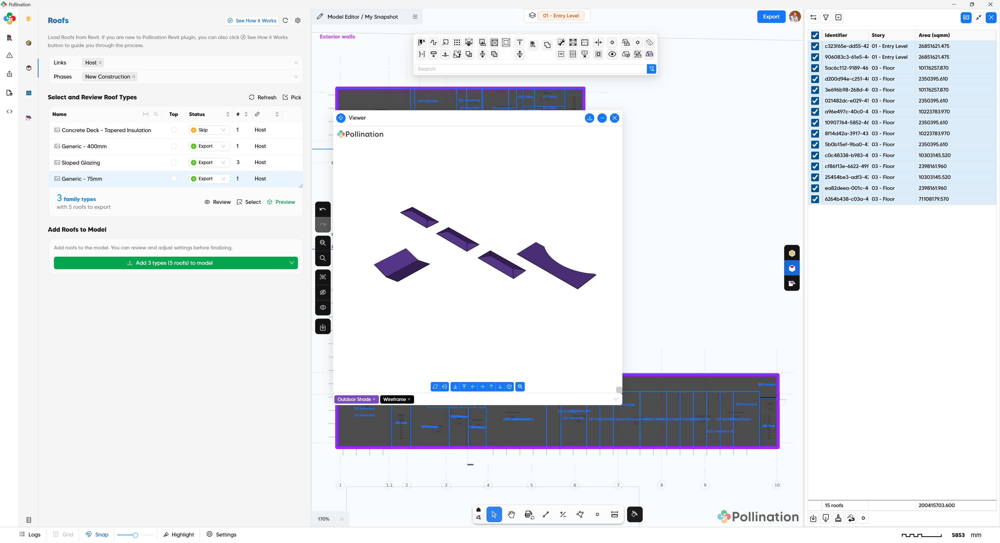
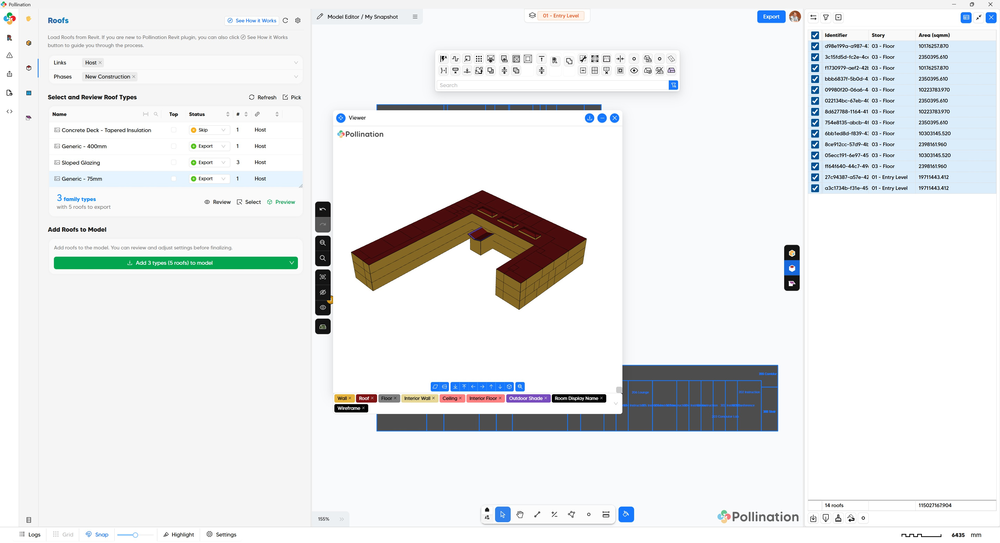

# Step 2: Add Roofs

<figure><figcaption></figcaption></figure>

In the second step, we will load the roofs from Revit and add them to the Model Editor. You only want to export roofs if they are slanted roofs or have a different height than the default floor extrusion height. In most models, you will need to perform some clean up on the roofs in the Model Editor to ensure they align with the room boundaries and remove any unwanted holes or overlaps.

## Typical workflow

First ensure the correct **Links** and **Phases** are selected, then follow these steps to import your roofs.

1. **Isolate Roofs**: Press Ctrl + A to select all roofs, then right-click and select Review to view them in a Revit 3D view.
2. **Filter Selection**: In Revit, select any roofs you don't want, right-click, and choose Hide in View > Elements.
3. **Sync Visible**: Come back to this menu. Click Refresh and select Refresh from Visible Elements to update the list based on your current Revit view.
4. **Set to Export**: Change the Export Status column to "Export" for the selected roofs.
5. **3D Preview**: Click Preview to inspect the geometry. Adjust Arc Subdivision or Mesh Detail in settings if needed.
6. **Finalize**: Click Add to Model to begin the roof geometry cleaning process.

### Pro Tip

Use the "Pick" option to select faces from Floors or Generic Models that should be modeled as roofs.

## Pollination model

<figure><figcaption>
Load Revit roofs at the start of step 2
</figcaption></figure>

<figure><figcaption>
Rooms with slanted roofs at the end of step 2
</figcaption></figure>



## Video tutorial

Watch this video for a step-by-step guide:


