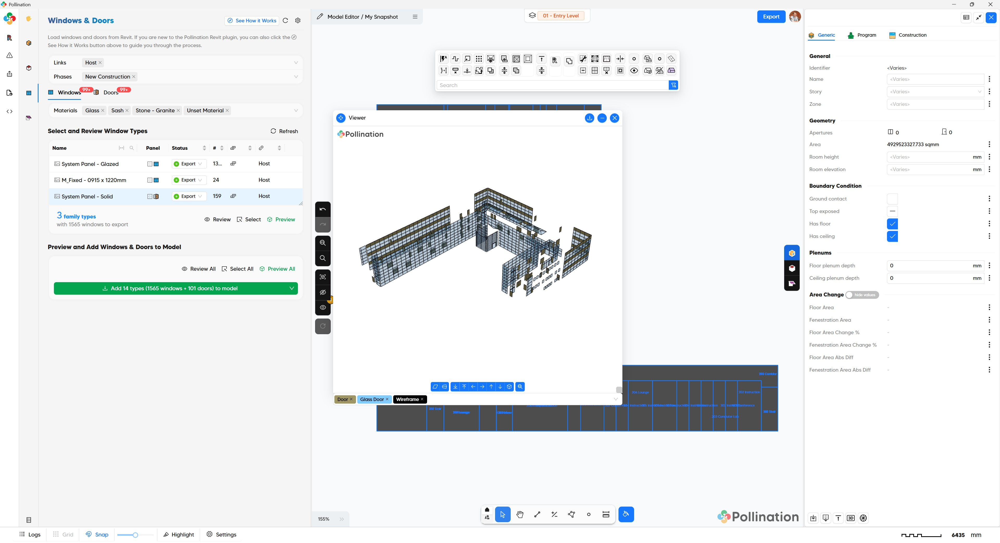
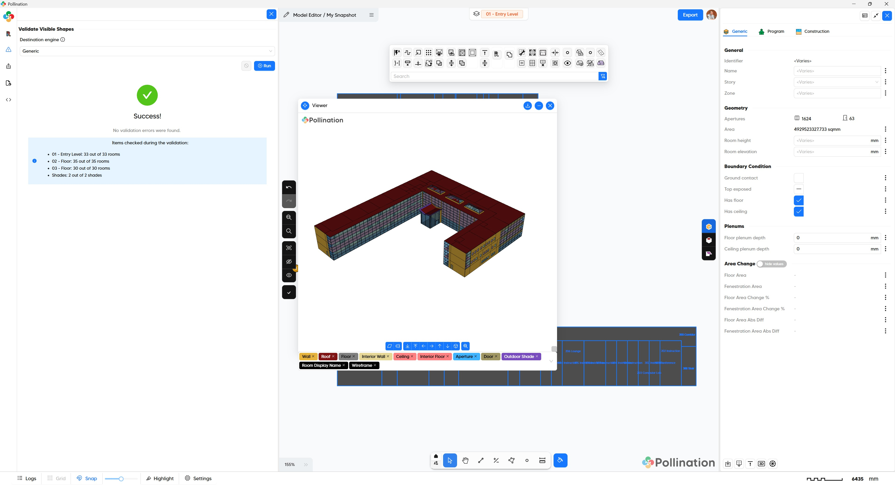

# Step 3: Add Windows & Doors

<figure><figcaption></figcaption></figure>

In the third step, we will load the openings from Revit and add them to the model inside the Model Editor. We will see how to customize the frame thickness and the type of the curtain panel before adding them to your model. At the end of this step we will have a full valid model with the sloped roofs and all the windows and doors.

## Typical workflow

Ensure the correct **Links** and **Phases** are selected, then follow these steps:

1. **Isolate Windows**: Under the Windows tab, press Ctrl + A to select all, then right-click and select Review to view them in Revit.
2. **Filter Selection**: In Revit, select any windows you don't want, right-click, and choose Hide in View > Elements.
3. **Sync Visible**: Return to this menu, click Refresh, and select Refresh from Visible Elements.
4. **Set to Export**: Change the Export Status column to "Export" for the selected windows.
5. **Repeat for Doors**: Switch to the Doors tab and repeat the process above.
6. **Joint Review**: Use Preview All or Select All to inspect windows and doors together. Ensure there are no overlaps between the two categories.
7. **Finalize**: Click Add to Model. You may need to adjust Projection Distance or Angle Tolerance in the settings depending on your wall thickness.

### Pro Tip

If your windows include shades with curved geometry, uncheck "Ignore Non-Planar Faces" and adjust the "Mesh Detail" in settings for better accuracy.

## Pollination model

<figure><figcaption>
Loading windows &#x26; doors from Revit at the start of step 3
</figcaption></figure>

<figure><figcaption>
Model with windows &#x26; doors at the end of step 3
</figcaption></figure>



## Video tutorial


