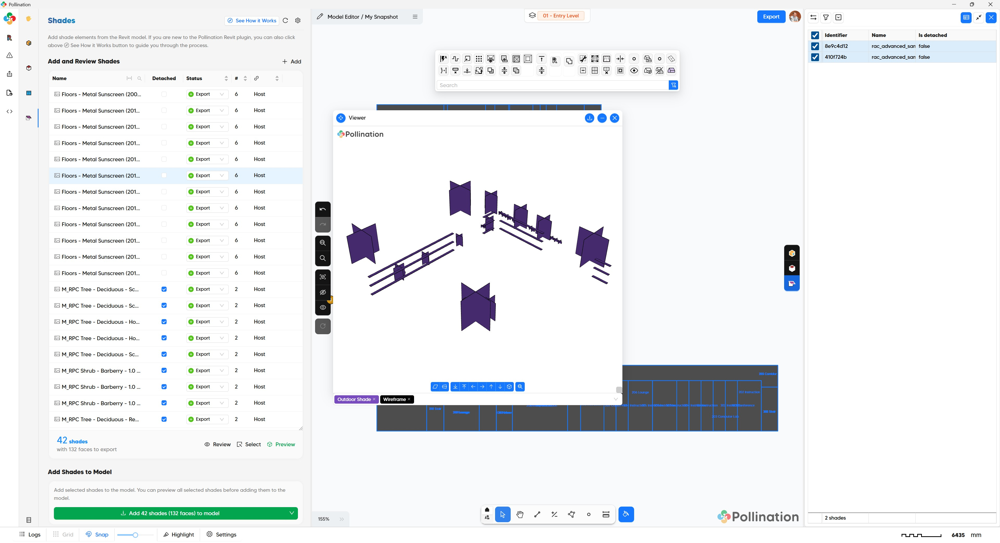
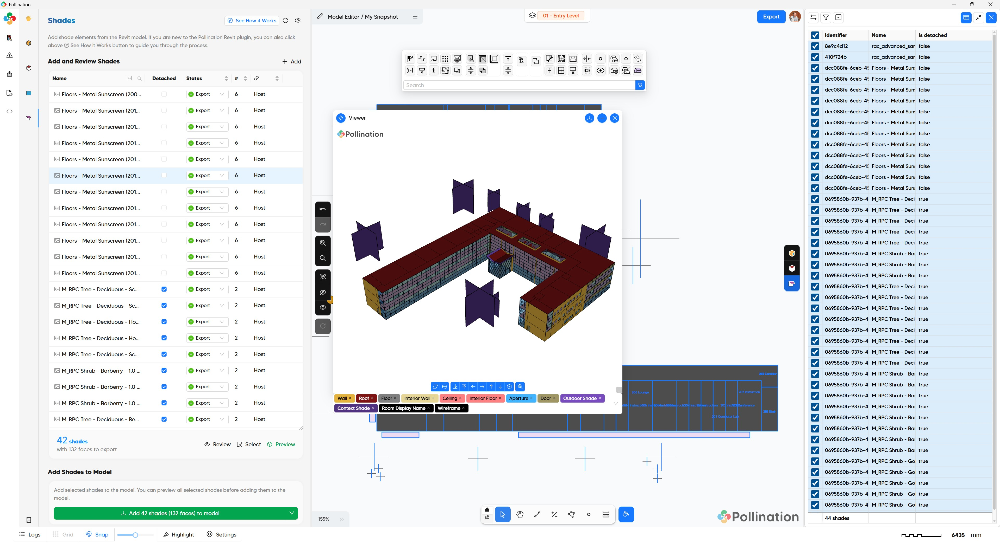

# Step 4: Add Shades

<figure><figcaption></figcaption></figure>

In the fourth step, we will load any the necessary Revit elements as shading objects.

## Typical workflow

Follow these steps to add shading geometry from your current Revit selection:

1. **Select in Revit**: Highlight the elements in your Revit model that you want to use as shades.
2. **Load Selection**: Click "Add Shades from Revit" to import your current selection into this menu.
3. **Review & Filter**: Right-click any item to Review or Select it in Revit. Uncheck the "Export" box to exclude specific items from the final model.
4. **3D Preview**: Click Preview to inspect the geometry.
5. **Finalize**: Click Add Shades to Model to complete the process.

### Pro Tip

If your selection includes curved or non-planar geometry, ensure "Ignore Non-Planar Faces" is unchecked in the settings. You can also adjust the "Mesh Detail" value to control the accuracy of the resulting mesh.

## Pollination model

<figure><figcaption>
Load shades from Revit
</figcaption></figure>

<figure><figcaption>
Pollination model with shades
</figcaption></figure>



## Video tutorial


