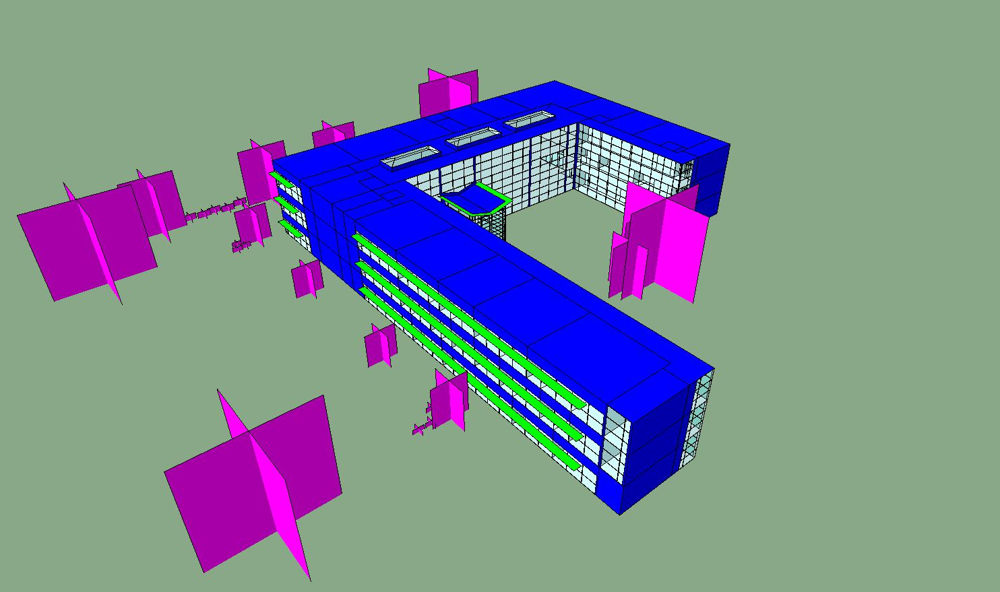
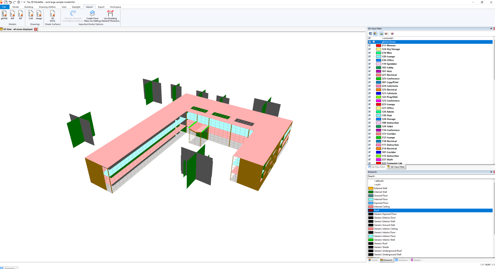

# Step 5: Export Model

<figure><figcaption></figcaption></figure>

Finally, we will head to the Export panel to send your model to your simulation engine of choice. Pollination supports a growing list of software, and we are continually working on adding new ones. If you don't see your energy modeling software of choice here, feel free to reach out to us to discuss possibilities.

## Video tutorial



## Sample exported models

### Pollination Rhino (.HBJSON)

<figure><figcaption>
Revit sample model in [Pollination] Rhino (.HBJSON)
</figcaption></figure>



### IESVE (.GEM)

<figure><figcaption>
Revit sample model in IESVE (.GEM)
</figcaption></figure>



### eQuest (.INP)

<figure><figcaption>
Revit sample model in eQuest (.INP)
</figcaption></figure>



### DesignBuilder (.dsbXML)

<figure><figcaption>
Revit sample model in DesignBuilder (.dsbXML)
</figcaption></figure>



### OpenStudio (.OSM)

<figure><figcaption>
Revit sample model in OpenStudio (.OSM)
</figcaption></figure>



### gbXML

<figure><figcaption>
Revit sample model in Spider (.gbXML)
</figcaption></figure>



In addition to the software that we listed above you could use the gbXML export to import the model to many other software including but not limited to Career HAP, and EDSL Tas. We also provide a modified version of the gbXML format optimized for TRACE 700, and TRACE 3D Plus.

<figure><figcaption>
Revit sample model in Tas (.gbXML)
</figcaption></figure>

<figure><figcaption>
Revit sample model in TRACE 3D Plus (.TRACEXML)
</figcaption></figure>

<figure><figcaption>
Revit Sample Model in HAP 6.3 (.gbXML)
</figcaption></figure>
