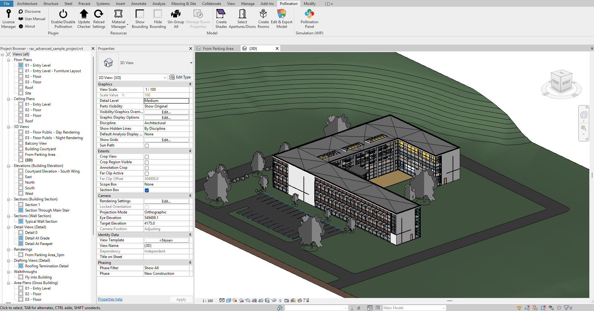

# Exporting the Valid Model



If you need the files, here are the files you'll need to follow along this section.



Here is a copy of the final model after validation.



Well done! Time to enjoy the outcome of your work. Click the export button, and export the model to any of the supported file formats.

<figure><figcaption></figcaption></figure>


If no geometry is selected, Pollination exports all the rooms and shades in the model. But if you select any of the rooms or shades, it will only export the selected items.


Here is a copy of the PoMF file.



For this tutorial, we will export the model to Pollination Rhino (.HBJSON), IESVE (.GEM), eQuest (.INP), DesignBuilder (dsbXML), OpenStudio (.OSM), and gbXML. See below for a screenshot of each exported model, and download the export files.

[You can learn more about all the supported file formats and the export options here](../../../model-editor/supported-file-formats/export.md).

### Pollination Rhino (.HBJSON)

<figure><figcaption>
Revit sample model in [Pollination] Rhino (.HBJSON)
</figcaption></figure>



### IESVE (.GEM)

<figure><figcaption>
Revit sample model in IESVE (.GEM)
</figcaption></figure>



### eQuest (.INP)

<figure><figcaption>
Revit sample model in eQuest (.INP)
</figcaption></figure>



### DesignBuilder (.dsbXML)

<figure><figcaption>
Revit sample model in DesignBuilder (.dsbXML)
</figcaption></figure>



### OpenStudio (.OSM)

<figure><figcaption>
Revit sample model in OpenStudio (.OSM)
</figcaption></figure>



### gbXML

<figure><figcaption>
Revit sample model in Spider (.gbXML)
</figcaption></figure>



In addition to the software that we listed above you could use the gbXML export to import the model to many other software including but not limited to Career HAP, and EDSL Tas. We also provide a modified version of the gbXML format optimized for TRACE 700, and TRACE 3D Plus.

<figure><figcaption>
Revit sample model in Tas (.gbXML)
</figcaption></figure>

<figure><figcaption>
Revit sample model in TRACE 3D Plus (.TRACEXML)
</figcaption></figure>

<figure><figcaption>
Revit Sample Model in HAP 6.3 (.gbXML)
</figcaption></figure>

