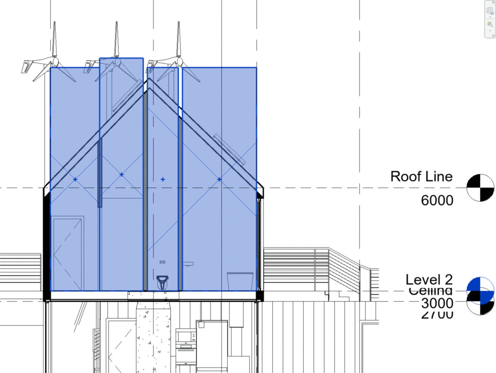
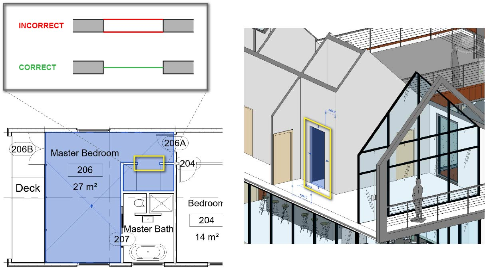

# Rooms and Room Separation Lines

Similar to the Rhino plugin, the Revit plugin uses a room-by-room approach to generating an analytical model for building energy modeling. Rooms must be added to the Revit model to export an analytical model.&#x20;

## Room & Area Settings

Avoid room export errors by selecting the "Areas and Volumes" room computation option. While this option might be slower than the areas only option, it generates rooms that are bounded more accurately in height.&#x20;

.png>)


If you have a pitched roof, you must select the room and extend it beyond the highest point of the roof in section view. If the Areas and Volumes Computation option is selected, the room will automatically match the room pitch to the roof pitch.   &#x20;


## Room Modeling and Bounding Settings

.png>)

Ensure all appropriate elements have room bounding properties assigned, this includes:&#x20;

* Walls
* Curtain Walls
* Floors
* Ceilings
* Roofs

In instances where multiple parallel walls are modeled, only one wall should have the room bounding properties assigned. Additionally, Pollination calculates the boundary for each room at the center of the wall, so all floor to wall and ceiling or roof to wall intersection points should be modeled to the center of the wall, not to the face of the wall.&#x20;

## Room Separation Lines

### General

As an overall strategy, minimize the use of room separation lines and avoid overlapping room separation lines. Pollination uses room separation lines to export air boundaries, so if there are instances where the room separation line overlaps with an already room bounding wall, curtain wall, or storefront, it will cause errors in the translation to an analytical model.&#x20;

### Walk-Through Openings&#x20;

When you have a door-less opening in a wall that allows for passage, it is important to place the room separation line correctly. In the example below, a walk-through opening is shown in axonometric and in plan view. In this instance, the room separation line should be located at the centerline of the wall assembly to properly export the opening as part of that wall.&#x20;


At this time, Revit creates a single surface from the room separation line to represent the room opening. It gets exported as a full-height surface that requires some manual post-processing to be an air boundary. We need **two **coplanar surfaces that are the same height.  &#x20;


