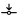

# Fixing Visible Misalignment and Gaps



For anyone who might need the files, here are the files you'll need to follow this section.



In this step, we fix the misalignment in the model where the room walls/edges are not aligned. We also remove the small holes from the model and fill the gaps between the rooms. The most frequently used commands for this step are:

*  [Auto Align](../../../../model-editor/commands/me_auto_align.md)
*  [Align \[to Line\]](../../../../model-editor/commands/me_align.md)
*  [Remove Holes](../../../../model-editor/commands/me_remove_holes.md)
*  [Pull to Room](../../../../model-editor/commands/me_pull_to_room.md)
*  [Remove Short Segments](../../../../model-editor/commands/me_remove_short_segments.md)
*  [Join Coplanar Faces](../../../../model-editor/commands/me_join_coplanar_faces.md)
