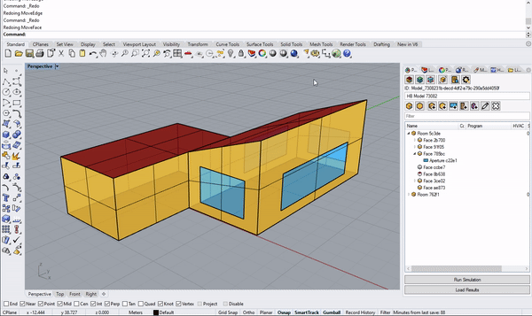

# Getting Started in Rhino

There are two interfaces for Pollination in Rhino. You can use the Pollination panel to use buttons to create your analytical model, or you can type Pollination commands in the command line.&#x20;

## Pollination Panel

To pull up the Pollination panel, type `Pollination` in the command line. Once you hit Enter, the Pollination panel will emerge. You can dock it in your window as you would a native Rhino panel.



## Pollination Commands

A list of Pollination Commands for Rhino with detailed descriptions is available in this user manual. You can also type "PO\_" in the command line to preview a list of commands in Rhino.


[pollination-commands](pollination-commands/)


### Native Rhino Command Compatibility

Besides custom Pollination commands, there are several native Rhino commands that can be used to modify custom Pollination RhinoObjects.

|                              ACTION                             | COMMAND LINE |       | KEYBOARD SHORTCUT |
| :-------------------------------------------------------------: | :----------: | :---: | :---------------: |
|                          COPY / CTRL+C                          |     **✔**    | **✔** |       **✔**       |
|                           CUT / CTRL+X                          |     **✔**    |       |       **✔**       |
|                          PASTE / CTRL+V                         |     **✔**    | **✔** |       **✔**       |
|                          UNDO / CTRL+Z                          |     **✔**    |       |       **✔**       |
|                          REDO / CTRL+Y                          |     **✔**    |       |       **✔**       |
|                              DELETE                             |     **✔**    |       |       **✔**       |
|                               MOVE                              |     **✔**    | **✔** |                   |
|  
MOVE SUB-GEOMETRY

<em>(Hold Shift+Ctrl keys)</em>
 |     **✔**    | **✔** |                   |
|                    SCALE, SCALE 1D, SCALE 2D                    |     **✔**    | **✔** |                   |
|                      MOVE FACE / MOVE EDGE                      |     **✔**    |       |                   |
| 
EXPLODE

<em>(RoomObject=> OrphanedFaces only)</em>
 |     **✔**    |       |                   |
|       
JOIN

(OrphanedFaces => RoomObject only)
      |     **✔**    |       |                   |
|                      SPLITFACE / MERGEFACE                      |     **✔**    |       |                   |
|                             FLIP/DIR                            |     **✔**    |       |                   |
|                               CAP                               |     **✔**    |       |                   |
|                           TRIM/UNTRIM                           |     **✔**    |       |                   |

.gif>)

