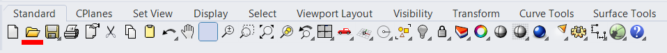
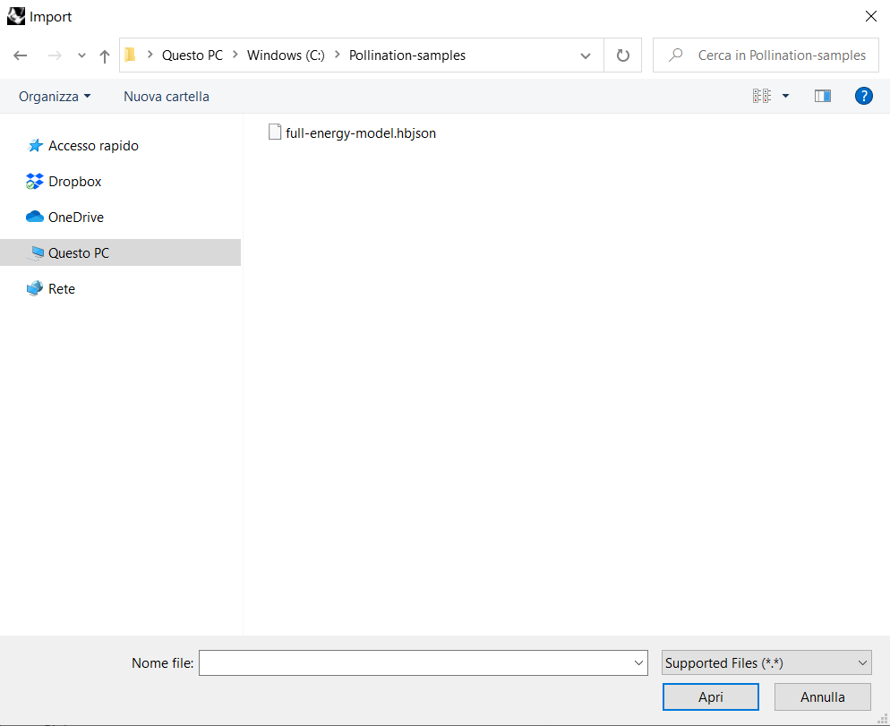
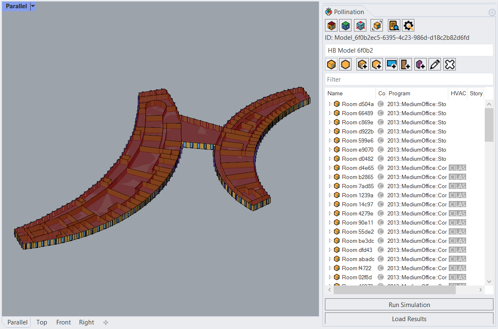
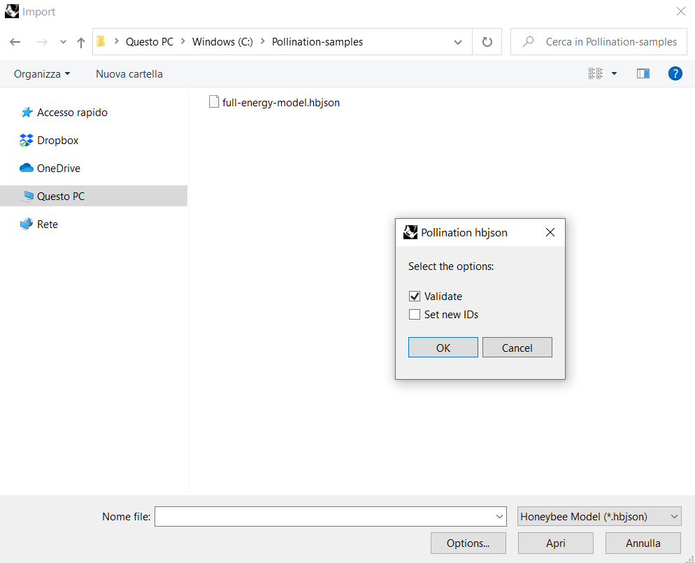

# Import HBJSON files

Use the standard toolbar of Rhino to open the "Import" window. Right click on the button with the folder icon or use the cascade menu: File/Import

Navigate on the local machine and select the file to import.

Add the file format filter to show only the selected file format to speed up the process. Click on the "Open" button to complete the operation.

## Validation

It is an optional process that checks the validity of the hbjson to import or open. Just specify the extension to read and click on the radio button "validation".

It is an helpful functionality to debug a model and fix it.

### Tip and Tricks

Drag and drop the file directly into the Rhino canvas to skip the selection phase by user interface.
