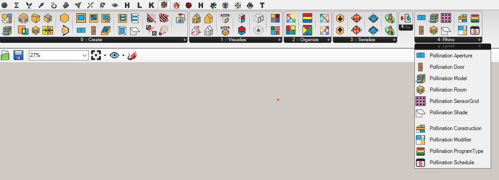

# Ladybug Tools Grasshopper Plugins

Pollination Rhino plugin can be used alongside the Grasshopper Ladybug Tools plugins.

Pollination Rhino plugin adds a new tab to honeybee for bidirectional integration to Rhino.

