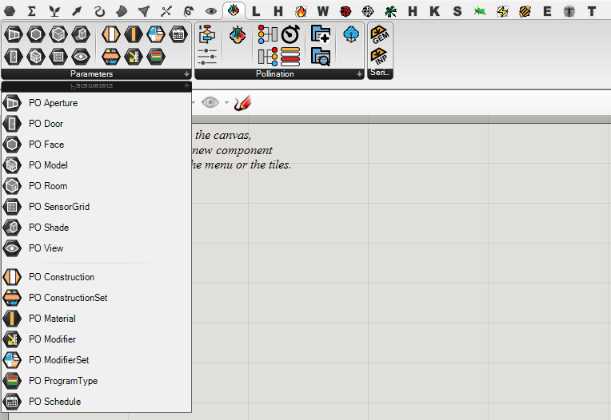

# Ladybug Tools Grasshopper Plugins

Pollination Rhino speeds up the process creating and validating the analytic models. We have created several components to ensure these models can be used seamlessly with the Ladybug Tools Grasshopper plugins.

**Pollination Rhino** plugin adds two new categories to the Pollination Grasshopper tab for bidirectional integration to Rhino:

1. Parameters
2. Serialization

There are three kind of components:

* _Entity components_ to translate Pollination Rhino entities into Honeybee entities
* _Library components_ to use Pollination UI from inside Grasshopper
* _Serializer components_ to serialize a Pollination model to other file formats.
