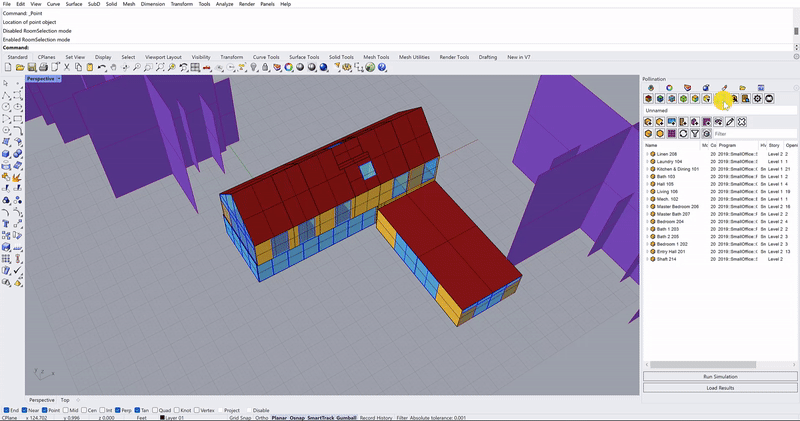

# Using Room Selection Mode

## **Room Selection Mode**

You can find a button to toggle `RoomSelection` mode ON/OFF in the first row of icons of the Pollination Panel. When the button is saturated, it is ON. When it is grayed out, it is OFF.

.png>)

### RoomSelection ON

When turned ON, you can select a room (parent) along with all its apertures, doors, and shades (child). The same effect applies to the orphaned face/aperture/door as well. This is useful when you want to transform or select rooms (move, scale, rotate, etc) without missing child surfaces.&#x20;

### RoomSelection OFF

When turned OFF, the selection ignores all parent-child relationships. All geometries will be in an independent state, so you can select individual parent and child surfaces.


**Rhino Selection Tip**

If you create a selection window from left to right, Rhino will only select objects that are fully within the selection window.&#x20;

If you create a section window from right to left, Rhino will select all objects that both fall within and intersect the selection window.



**Pollination Selection Tip**

Combine RoomSelection OFF with [po\_selapertures.md](../pollination-commands/po\_selapertures.md "mention") to select all apertures from a room, face, or building.

