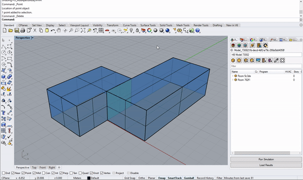
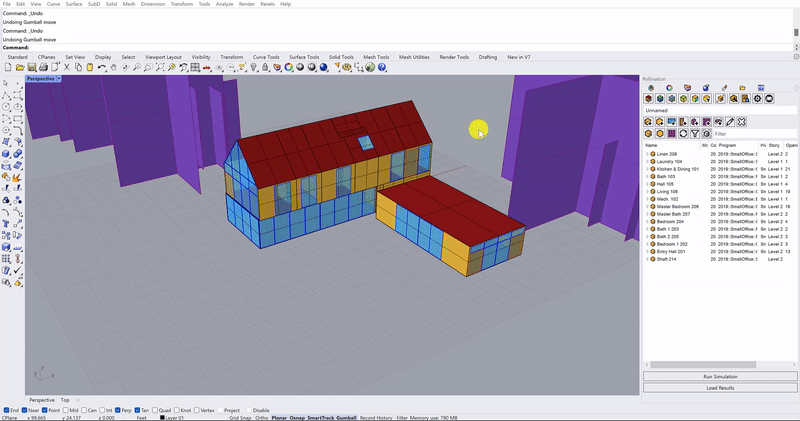

# PO\_AddAperturesByWWR

<figure><figcaption>
Add apertures to room by window to wall ratio
</figcaption></figure>

 

<figure><figcaption>
Right aligned image
</figcaption></figure>

 

<figure><figcaption>
Room selection mode
</figcaption></figure>

### Options

*   **WindowWallRatio\_North**

    set a number between 0 to 1 for WWR. (default:0.4)
*   **WindowWallRatio\_East**

    set a number between 0 to 1 for WWR. (default:0.4)
*   **WindowWallRatio\_South**

    set a number between 0 to 1 for WWR. (default:0.4)
*   **WindowWallRatio\_West**

    set a number between 0 to 1 for WWR. (default:0.4)
*   **Subdivide**

    Boolean to note whether to generate a single window in the center of each Face(False) or to generate a series of rectangular windows using the other inputs below(True). (default: No)
*   **Window\_Height**

    A number for the target height of the output apertures.
*   **Sill\_Height**

    A number for the target height above the bottom edge of the face to start the apertures.
*   **Horizontal\_Separation**

    A number for the horizontal separation between individual aperture centerlines.
*   **Vertical\_Separation**

    An optional number to create a single vertical separation between the top and bottom apertures. (default:0.0)

### See Also

* [PO\_AddApertures](po\_addaperturesbywwr.md)
* [PO\_DrawApertures](po\_drawapertures.md)

### Discourse Topics



### Video Tutorials


How to export the Pollination Rhino Model to IES


Enjoy!
