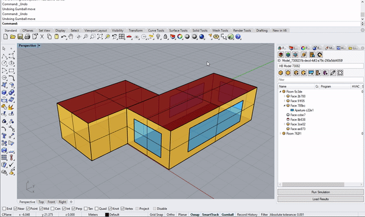

# Getting Started

Similar to Rhino, you can use the Pollination Rhino plugin from a panel or type commands in the command line. You can check out detailed descriptions of [Pollination Commands for Rhino](pollination-commands-for-rhino/) in our user manual or you can type "PO\_" in the command line to see the list of commands in Rhino.

## Pollination Panel

To pull up the Pollination panel, type `Pollination` in the command line. Once you hit Enter, the Pollination panel will emerge. You can dock it in your window as you would a native Rhino panel. 

## Rhino and Pollination Compatibility

Besides custom [Pollination Commands for Rhino](pollination-commands-for-rhino/), there are several native Rhino commands that can be used to modify custom Pollination RhinoObjects.

<table>
  <thead>
    <tr>
      <th style="text-align:left">ACTION</th>
      <th style="text-align:center">COMMAND-LINE</th>
      <th style="text-align:center">GUMBALL</th>
      <th style="text-align:center">
        
KEYBOARD

        
SHORTCUT

      </th>
    </tr>
  </thead>
  <tbody>
    <tr>
      <td style="text-align:left">COPY / CTRL+C</td>
      <td style="text-align:center"><b>&#x2714;</b>
      </td>
      <td style="text-align:center"><b>&#x2714;</b>
      </td>
      <td style="text-align:center"><b>&#x2714;</b>
      </td>
    </tr>
    <tr>
      <td style="text-align:left">CUT / CTRL+X</td>
      <td style="text-align:center"><b>&#x2714;</b>
      </td>
      <td style="text-align:center"></td>
      <td style="text-align:center"><b>&#x2714;</b>
      </td>
    </tr>
    <tr>
      <td style="text-align:left">PASTE / CTRL+V</td>
      <td style="text-align:center"><b>&#x2714;</b>
      </td>
      <td style="text-align:center"><b>&#x2714;</b>
      </td>
      <td style="text-align:center"><b>&#x2714;</b>
      </td>
    </tr>
    <tr>
      <td style="text-align:left">UNDO / CTRL+Z</td>
      <td style="text-align:center"><b>&#x2714;</b>
      </td>
      <td style="text-align:center"></td>
      <td style="text-align:center"><b>&#x2714;</b>
      </td>
    </tr>
    <tr>
      <td style="text-align:left">REDO / CTRL+Y</td>
      <td style="text-align:center"><b>&#x2714;</b>
      </td>
      <td style="text-align:center"></td>
      <td style="text-align:center"><b>&#x2714;</b>
      </td>
    </tr>
    <tr>
      <td style="text-align:left">DELETE</td>
      <td style="text-align:center"><b>&#x2714;</b>
      </td>
      <td style="text-align:center"></td>
      <td style="text-align:center"><b>&#x2714;</b>
      </td>
    </tr>
    <tr>
      <td style="text-align:left">MOVE</td>
      <td style="text-align:center"><b>&#x2714;</b>
      </td>
      <td style="text-align:center"><b>&#x2714;</b>
      </td>
      <td style="text-align:center"></td>
    </tr>
    <tr>
      <td style="text-align:left">MOVE SUB-GEOMETRY</td>
      <td style="text-align:center"><b>&#x2714;</b>
      </td>
      <td style="text-align:center"><b>&#x2714;</b>
      </td>
      <td style="text-align:center"></td>
    </tr>
    <tr>
      <td style="text-align:left">SCALE, SCALE 1D, SCALE 2D</td>
      <td style="text-align:center"><b>&#x2714;</b>
      </td>
      <td style="text-align:center"><b>&#x2714;</b>
      </td>
      <td style="text-align:center"></td>
    </tr>
    <tr>
      <td style="text-align:left">MOVE FACE / MOVE EDGE</td>
      <td style="text-align:center"><b>&#x2714;</b>
      </td>
      <td style="text-align:center"></td>
      <td style="text-align:center"></td>
    </tr>
    <tr>
      <td style="text-align:left">
        
EXPLODE

        
<em>(RoomObject=&gt; OrphanedFaces only)</em>
        

      </td>
      <td style="text-align:center"><b>&#x2714;</b>
      </td>
      <td style="text-align:center"></td>
      <td style="text-align:center"></td>
    </tr>
    <tr>
      <td style="text-align:left">
        
JOIN

        
(OrphanedFaces =&gt; RoomObject only)

      </td>
      <td style="text-align:center"><b>&#x2714;</b>
      </td>
      <td style="text-align:center"></td>
      <td style="text-align:center"></td>
    </tr>
    <tr>
      <td style="text-align:left">SPLITFACE / MERGEFACE</td>
      <td style="text-align:center"><b>&#x2714;</b>
      </td>
      <td style="text-align:center"></td>
      <td style="text-align:center"></td>
    </tr>
  </tbody>
</table>

