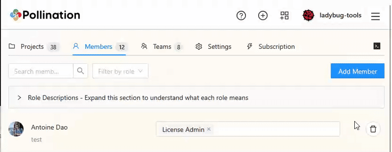

# 3. Add Organization Members


You can only add additional members to your organization after purchasing additional seats. See [this page](purchase-additional-seats.md) for more information about purchasing additional seats.



Only members with Super Admin, Project Admin, or License Admin roles can add new members to the organization.



Only Super Admin members can change the roles for other organization members. You can&#x20;


Here is the step-by-step process to add a Pollination account as a member to your organization. The first step is to add the member to the organization, and the second step is to give them the appropriate role in the organization.

### Add a new member to the organization

1. Click on your profile picture and switch to the organization account.
2. Go to the Members tab under the organization page.
3. Click on the <mark style="background-color:blue;">Add Member</mark> button on the top right.
4. Search for the account name.
5. Click on the <mark style="background-color:blue;">Add</mark> button.

<figure><figcaption>
Add an organization member
</figcaption></figure>

### Change members' organizational role

By default, every new member will have no roles. As a basic member, they will see the other organization members, their roles, and the organization's public projects.  A basic member can be added to teams to get access to the organization license pools or private projects.

If you want an organization member to be able to manage resources, you will need to change their organizational role. You can simply change the roles by clicking on the field in front of the member's name and selecting the new role.

<figure><figcaption></figcaption></figure>

Each member can have several roles at the same time.


If the new member is added as a basic member to the organization, they will NOT have access to the Rhino or Revit licenses by default. You must give them access to the CAD licenses by [adding them to a team with access to a license pool](../../get-started/manage-license-pool.md).

This allows you to add several members to the organization and limit the number of users who can use the organization's CAD plugin licenses.


### Understanding Pollination organization roles

Currently, Pollination offers four different organizational roles:

#### Super Admin

This role can manage all resources in the organization. They can:

* Manage organization members.
* Manage teams and change team members.
* Manage license pools and add or remove teams from license pools.
* Manage projects and add or remove teams from projects.
* Manage the subscriptions.

They also get access to CAD licenses and all the private projects automatically. The best practice is to minimize the number of Super Admins in your organization.


An organization must at least have one super admin. We recommend assigning an additional super admin to help you with managing the organization. A good practice is to keep everyone else as a basic member unless they must be an admin to manage the organization's resources.


#### Billing Admin

A billing admin can manage the organization's billing and subscriptions. They can:

* Manage the subscriptions.

#### License Admin

A license admin can manage the license pools. They can:

* Manage license pools and add or remove teams from license pools.
* Manage teams and change team members.
* Add or remove organization members without changing their roles.

#### Project Admin

* Manage projects and add or remove teams from the projects.
* Manage teams and change team members.
* Add or remove organization members without changing their roles.
