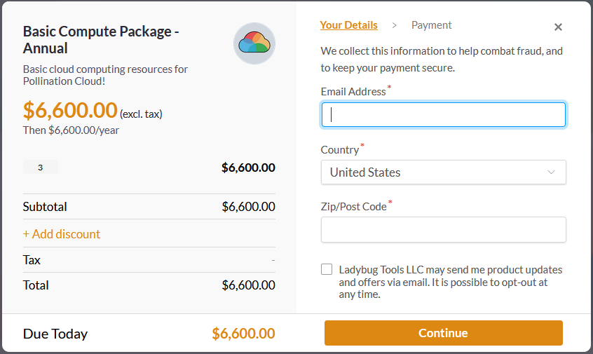

# 6. Add Additional Computing Resources

An organization includes an unlimited number of projects, recipes, and teams but it doesn't include any computing resources by default. To run simulations under an organization account, you need to buy additional computing resources for your organization.


The computing resources will be shared among all the organization's projects and members.


Pollination provides several options based on your needs. You can either select a monthly or an annual billing period.


The annual billing offers a free month of subscription.



We might introduce new computing packages. You can always check our [pricing page](https://www.pollination.cloud/pricing#cloud-computing) to learn more about the latest available options.


To purchase additional cloud computing for your organization:

1. Go to the organization and find the subscription tab.
2.  Scroll to the Compute Package Subscription card.\

    <figure><figcaption></figcaption></figure>
3.  Use the dropdown to select the ideal cloud computing plan for your organization.\

    <figure><figcaption></figcaption></figure>
4.  Select the Quantity and Billing Period. The billing period is set to a yearly subscription by default which gives you a month of subscription for free.\

    <figure><figcaption></figcaption></figure>
5.  Click on the `Subscribe` button and continue with the purchase.\

    

    If you have a discount code you may use it at this step and before finishing the purchase by clicking on the `+ Add discount` button.
6.  Congrats! Cloud computing resources are now added to your organization. Now you can use them to run your studies on the cloud.\

    <figure><figcaption></figcaption></figure>


We use Paddle for processing the payments. As a result, it might take a few seconds before the subscription shows up under your account. If you don't see the subscription under your account immediately, try to refresh the page and the card should be updated.

