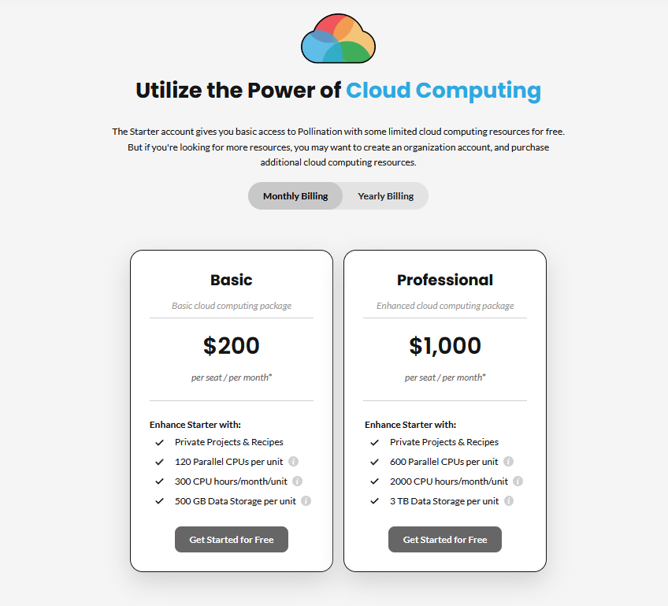
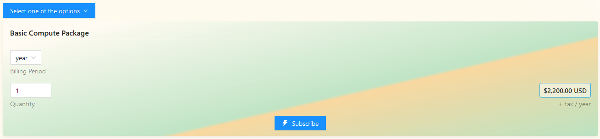
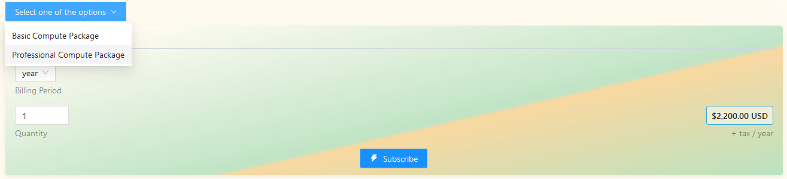
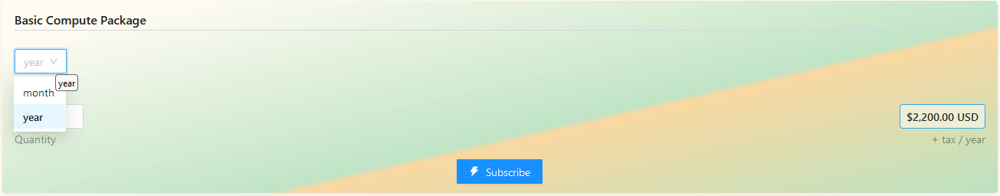

# Purchase Additional Computing Resources

An organization includes unlimited number of projects, recipes and teams but it doesn't include any computing resources by default. In order to run simulations under an organization account, you need to  buy additional computing resources for your organization.



The computing resources will be shared among all the organization projects and members.



Pollination provides several options based on your needs. You can either select a monthly or an annual billing period.



The annual billing offers a free month of subscription.





We might introduce new computing packages. You can always check our [pricing page](https://www.pollination.cloud/pricing#cloud-computing) to learn more about the latest available options.



In order to purchase additional cloud computing for your organization:

1. Go to the organization and find the subscription tab.
2. Scroll to the cloud computing card.

   

3. Use the dropdown to select the ideal cloud computing package for your organization.

   

4. Select the `Billing Period`. It is set to yearly subscription by default which gives you a month of subscription for free.

   

5. Change the `Quantity` of the package if needed. Keep in mind that the quantity will be multiplied by the amount of resources that are available in the package. Keep in mind that the number of parallel CPUs is capped at 1200 CPUs for each organization.

   

6. Click on the `Subscribe` button and continue with the purchase.

   

   If you have a discount code you may use it at this step and before finish the purchase by clicking on the `+ Add discount` button.

7. Congrats! The cloud computing resources are now added to your organization. Now you can use them to run your studies on the cloud.



We use Paddle for processing the payments. As a result, it might take a few seconds before the subscription shows up under your account. If you don't see the subscription under your account immediately try to refresh the page and the card should be updated.


