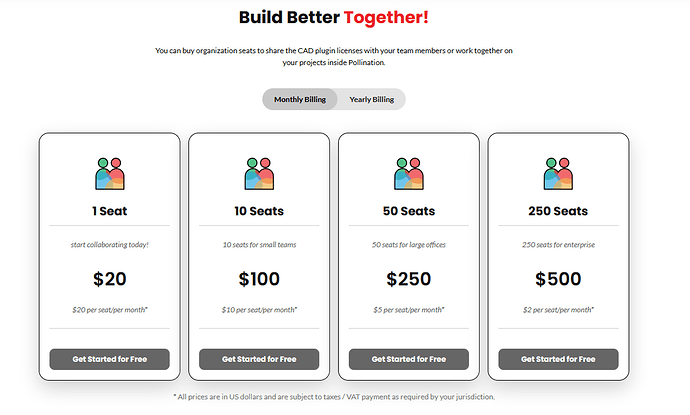
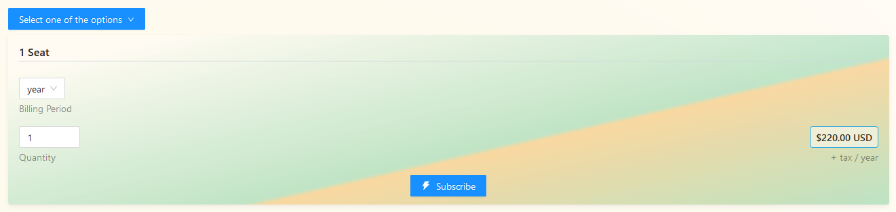
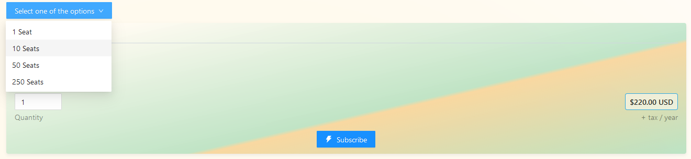
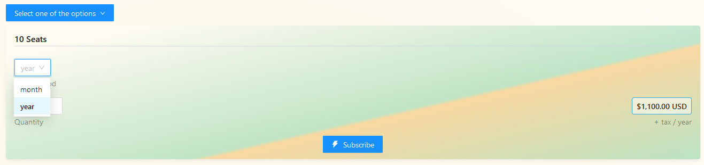
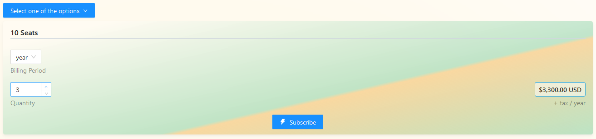
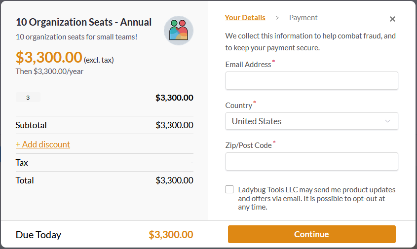

# Purchase Organization Seats

You need to add additional seats to your organization account before adding new members
to the organization.

Pollination provides several options based on the size of your team. You can either select a monthly or an annual billing period.


The annual billing offers a free month of subscription.


In order to purchase the seats for your organization:

1. Go to the organization and find the subscription tab.
2. Scroll to the seats card.

   

3. Use the dropdown to select the ideal organization seats package for your organization.

   

4. Select the `Billing Period`. It is set to yearly subscription by default which gives you a month of subscription for free.

   

5. Change the `Quantity` of the package if needed. Keep in mind that the quantity will be multiplied by the number of seats that are available in your package. For example, if you are buying a 10 seats subscription with the quantity of 3, you will have 3 * 10 = 30 seats.

   

6. Click on the `Subscribe` button and continue with the purchase.

   

   If you have a discount code you may use it at this step and before finish the purchase by clicking on the `+ Add discount` button.

7. Congrats! The seats are now added to your organization. The next step is to add new members to your organization.



We use Paddle for processing the payments. As a result, it might take a few seconds before the subscription shows up under your account. If you don't see the subscription under your account immediately try to refresh the page and the card should be updated.


