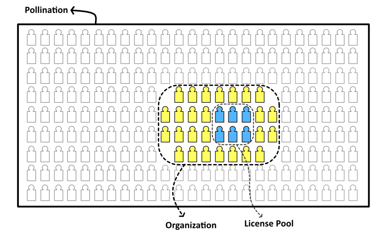

# Organization Seats vs Licenses

One of the frequently asked questions about Pollination offering is the relationship between organization seats and floating licenses.

Organization seats are required for adding new members to the organization. Once a member is added to the organization, they can access the organization resources (i.e., CAD licenses and cloud computing). This means that every Pollination account that is going to have access to the CAD licenses from the license pool should be a member of the organization. The access to the CAD license [is managed by using license pools](../../get-started/manage-license-pool.md).

When you buy a new license for a CAD plugin you are adding to the number co-current activations. For example, if an organization has two Rhino licenses two members of the organization Rhino license pool can use the Pollination Rhino plugin at the same time.



The optimum combination of number of seats versus the number of licenses depends on how many people should have access to the licenses and the maximum number of users who will use the license at the same time.

For example, if 10 members of your team use the Rhino plugin and maximum 3 of them will use the Rhino plugin at the same time you need to buy 10 organization seats and 3 Rhino licenses.


